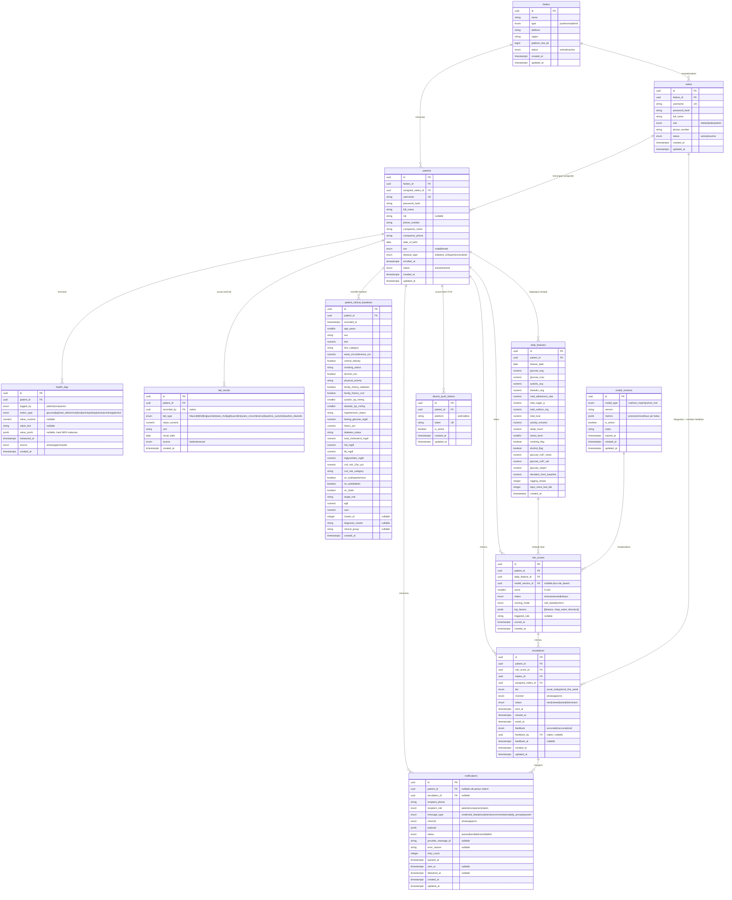

# Sehatiku — Entity Relationship Design (ERD)

> Backend data model untuk MVP Sehatiku — predictive chronic disease monitoring
> sebagai lapisan harian pengisi celah 29 hari antar kontrol Prolanis.
>
> Stack acuan: Go (Fiber/Gin) + GORM + PostgreSQL. ML microservice (Python/FastAPI)
> menulis ke `daily_features` dan `risk_scores`.

## Konvensi Global

- **Primary key:** `UUID v4` (`gen_random_uuid()` via `pgcrypto`/`uuid-ossp`) untuk semua tabel.
  Tidak membocorkan jumlah pasien, aman untuk distributed.
- **Penamaan:** `snake_case` plural (konvensi GORM default).
- **Timestamps:** semua tabel punya `created_at TIMESTAMPTZ NOT NULL DEFAULT now()`.
  Tabel yang dapat berubah juga punya `updated_at`. Tabel insert-only TIDAK punya `updated_at`.
- **Tenancy:** `faskes_id` selalu divalidasi dari JWT nakes pada setiap query dashboard
  (hard isolation, pola Wiradana). Pasien milik tepat satu faskes.
- **Uang:** disimpan sebagai `BIGINT` Rupiah (integer, tanpa desimal).
- **Insert-only tables:** `health_logs`, `lab_results`, `risk_scores` — tidak ada UPDATE/DELETE,
  full audit trail untuk data medis.
- **Catatan PK volume tinggi:** `health_logs` memakai UUID v4 acak. Untuk skala MVP
  (500–1.000 pasien) tidak masalah. Saat scale-up, pertimbangkan UUIDv7 (time-ordered)
  guna menghindari index bloat.

---

## Ringkasan Entitas (12 tabel)

| Cluster | Tabel | Peran | Sifat |
|---|---|---|---|
| Tenancy & Identitas | `faskes` | Tenant (Puskesmas/klinik Prolanis) | mutable |
| | `nakes` | User dashboard (dokter/kader/admin) | mutable |
| | `patients` | Peserta Prolanis (punya akun WA) | mutable |
| Data Mentah | `health_logs` | Event stream input harian WA | insert-only |
| | `lab_results` | Hasil lab faskes (point-in-time) | insert-only |
| Turunan ML | `patient_clinical_baselines` | Baseline klinis lengkap per pasien (33 fitur ML) | insert-only |
| | `daily_features` | Vektor fitur typed per pasien/hari | batch-generated |
| | `risk_scores` | Output skor + status + SHAP | insert-only |
| Aksi & Komunikasi | `escalations` | Peristiwa klinis + feedback nakes | mutable |
| | `notifications` | Transport WA/SMS keluar | mutable |
| | `device_push_tokens` | Token FCM untuk push notification native Patient App | mutable |
| Governance ML | `model_versions` | Versioning & metrik model | mutable |

---

## Diagram Relasi (Mermaid)



---

## Catatan Desain per Cluster

### 1. Tenancy & Identitas

- **`patients` punya akun penuh** (`username` + `password_hash`), bukan sekadar nomor WA.
  Saat faskes mendaftarkan pasien, mereka menginput: data pasien, **satu** `companion_phone`,
  dan `assigned_nakes_id` (dokter penanggung jawab). Registrasi memicu `credential_blast`
  via `notifications` ke nomor pasien DAN pendamping.
- `assigned_nakes_id` di `patients` membuat `escalations.assigned_nakes_id` deterministik —
  tidak perlu logika assignment terpisah.
- Isolasi tenant: setiap query dashboard WAJIB memfilter `faskes_id` dari JWT.

### 2. Data Mentah (insert-only)

- **`health_logs` = event stream.** Satu baris per pengukuran, bukan per hari. Input WA datang
  sembarang waktu (gula pagi, makan sore, tidur malam) → setiap pesan = satu insert.
  `measured_at` menjaga timestamp asli. Tipe nilai fleksibel via kombinasi
  `value_numeric` / `value_text` / `value_jsonb` sesuai `metric_type`.
  - Contoh: `metric_type=glucose` → `value_numeric=180`. `metric_type=food` →
    `value_text="nasi goreng porsi sedang"`, `value_jsonb={parsed NER result}`.
  - **Konvensi `metric_type=bp` (tekanan darah):** disimpan sebagai
    `value_jsonb = {"systolic": 120, "diastolic": 80}` (dua angka dalam satu baris,
    bukan dua log terpisah). Konvensi ini mengikat endpoint input health_logs di masa
    depan dan dibaca oleh dashboard pasien (`GET /api/v1/patients/dashboard`).
- **`lab_results` = point-in-time.** Satu baris per (pasien, lab_type, result_date), independen
  per jenis lab (karena HbA1c/lipid/eGFR punya jadwal berbeda).
  - **As-of join (cegah temporal leakage, Risiko #5):**
    ```sql
    SELECT DISTINCT ON (lab_type) lab_type, value_numeric, result_date
    FROM lab_results
    WHERE patient_id = $1 AND result_date <= $2  -- $2 = tanggal fitur T
    ORDER BY lab_type, result_date DESC;
    ```
  - `days_since_last_lab` dihitung dari sini → masuk ke `daily_features`.

### 3. Turunan ML

- **`patient_clinical_baselines` = vektor baseline ML per pasien.** Diisi saat faskes mendaftarkan pasien; tidak pernah di-UPDATE (insert-only). Berisi 33 fitur klinis yang menjadi setengah payload ML (bersama `daily_features`). `age_years` dan `sex` disimpan di sini (meski sudah ada di `patients`) agar vektor ML self-contained dan tidak bergantung join saat scoring. `cluster_id`, `diagnosis_cluster`, `clinical_group` nullable — diisi dari pre-labeling ML atau dikosongkan saat cold-start.
- **`daily_features` = jembatan ke model.** Cron job harian (job scheduler di proposal)
  mengagregasi `health_logs` + as-of join `lab_results` menjadi satu baris typed per pasien/hari.
  Ini SATU-SATUNYA sumber feature vector untuk XGBoost — kolom typed = cepat & ter-index,
  tidak perlu parsing JSONB saat scoring.
- **`risk_scores` = output, insert-only.** `scoring_mode` + `triggered_rule` mencatat
  lapisan mana yang menghasilkan skor (rule-based selalu aktif sebagai jaring pengaman,
  cohort menambah presisi di atasnya — keduanya BERLAPIS, bukan saling ganti).
  - SHAP `top_factors` di JSONB karena selalu dibaca sebagai paket utuh (3–5 faktor),
    tidak pernah di-query lintas pasien.
  - `model_version_id` NULL bila skor murni rule-based.

### 4. Aksi & Komunikasi

- **`escalations` ≠ `notifications`.** `escalations` = peristiwa KLINIS (pasien X berisiko,
  tier acute). `notifications` = TRANSPORT (pesan WA fisik terkirim/gagal). Satu eskalasi
  bisa memicu beberapa notifications.
- **`tier`** mewujudkan eskalasi bertingkat (akut "hubungi hari ini" vs tren "minggu ini")
  agar urgensi tidak diseragamkan (Risiko #4 alert fatigue).
- **`feedback`** = label emas satu-ketuk dari nakes ("tepat/tidak tepat"), disimpan inline
  (relasi 1:1 wajib, tidak akan tumbuh jadi 1:N). Query label training:
  `SELECT * FROM escalations WHERE feedback IS NOT NULL`.
- **Budget alert** (maks eskalasi/nakes/hari) BUKAN tabel — logika aplikasi:
  `COUNT(*) FROM escalations WHERE assigned_nakes_id=? AND sent_at::date=today` sebelum kirim.
- **`notifications`** mendukung audit + retry (WhatsApp Cloud API async; status via callback).
  Pelajaran durability RabbitMQ berlaku: `status`, `retry_count`, `provider_message_id`.
- **`device_push_tokens`** = token FCM (Firebase Cloud Messaging) untuk push notification
  native Patient App — pop-up sistem di HP pasien, terpisah dari `notifications` (transport
  WA/SMS) dan `patient_notifications` (inbox pull-only in-app). Multi-device: satu pasien
  boleh punya banyak token aktif. `UNIQUE(token)` + upsert menangani token yang pindah
  kepemilikan pasien (app uninstall/install ulang di HP lain). `is_active=false` menonaktifkan
  tanpa menghapus baris (soft-delete saat logout, atau auto-cleanup saat FCM menandai token
  invalid).

### 5. Governance ML

- **`model_versions`** memberi `risk_scores.model_version_id` sebuah FK rapi (bukan string bebas).
  Menjawab pertanyaan keselamatan "skor ini dari model versi mana?" saat investigasi false alarm.
  `metrics` JSONB menyimpan precision/recall historis per versi untuk drift monitoring.
  `is_active` menandai versi yang sedang melayani produksi per `model_type`.

---

## Index yang Disarankan

```sql
-- Tenancy & lookup
CREATE INDEX idx_nakes_faskes        ON nakes(faskes_id);
CREATE INDEX idx_patients_faskes     ON patients(faskes_id);
CREATE INDEX idx_patients_nakes      ON patients(assigned_nakes_id);
CREATE UNIQUE INDEX idx_patients_username ON patients(username);

-- Time-series scan (hot path agregasi)
CREATE INDEX idx_health_logs_patient_time ON health_logs(patient_id, measured_at);
CREATE INDEX idx_health_logs_metric       ON health_logs(patient_id, metric_type, measured_at);

-- As-of join lab
CREATE INDEX idx_lab_results_asof ON lab_results(patient_id, lab_type, result_date DESC);

-- Feature & scoring
CREATE UNIQUE INDEX idx_daily_features_patient_date ON daily_features(patient_id, feature_date);
CREATE INDEX idx_risk_scores_patient_time           ON risk_scores(patient_id, scored_at DESC);

-- Dashboard antrean prioritas (faskes melihat pasien terurut risiko)
CREATE INDEX idx_escalations_queue ON escalations(faskes_id, status, tier, sent_at DESC);
CREATE INDEX idx_escalations_label ON escalations(feedback) WHERE feedback IS NOT NULL;

-- Notifikasi retry
CREATE INDEX idx_notifications_retry ON notifications(status, retry_count) WHERE status = 'failed';

-- Push notification: token aktif per pasien
CREATE INDEX idx_device_push_tokens_patient ON device_push_tokens(patient_id) WHERE is_active = true;
```

---

## Keputusan yang Sengaja DITUNDA (di luar MVP)

- **Multi-faskes per pasien** (pasien pindah faskes) — saat ini 1 pasien : 1 faskes.
- **Multi-kontak keluarga** (>1 pendamping) — saat ini 1 companion_phone tunggal di `patients`.
- **Integrasi IoT** (glukometer/tensimeter Bluetooth) — `source` enum sudah disiapkan untuk
  ekstensi tanpa migrasi besar.
- **Integrasi SATUSEHAT / RME** — Sehatiku eksplisit BUKAN RME pada MVP.
- **Free-text NLP penuh** — `value_jsonb` sudah menampung hasil NER untuk ekstensi bertahap.